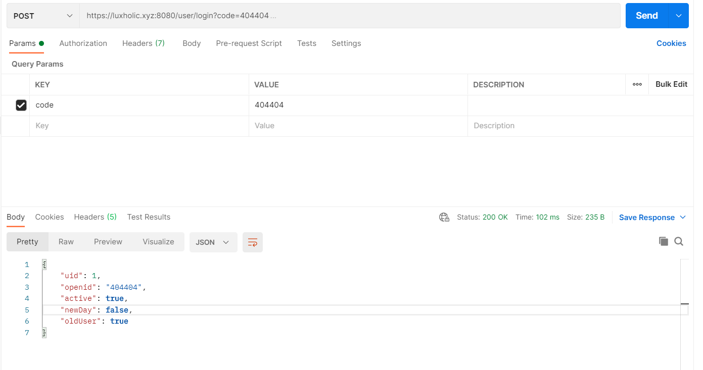
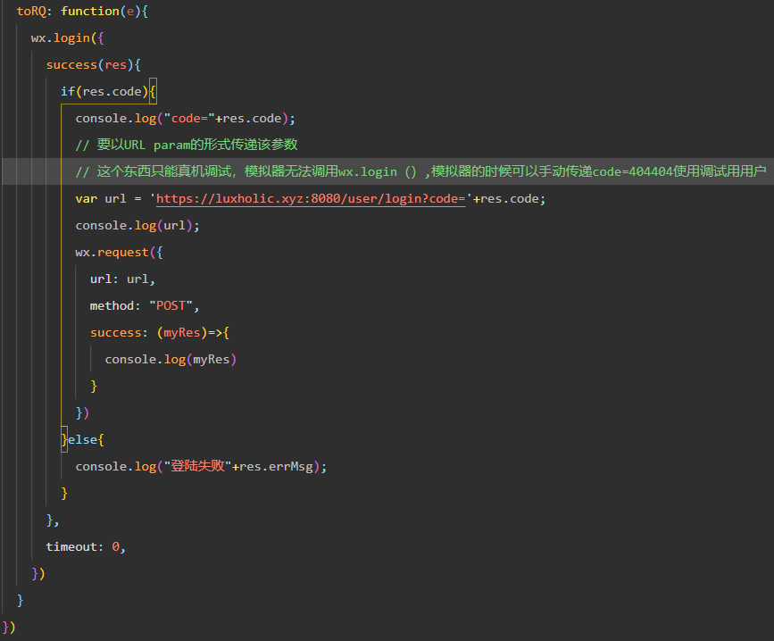
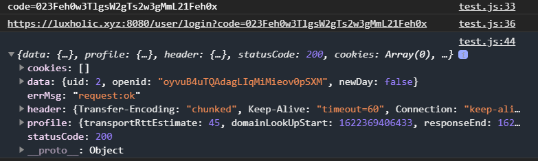
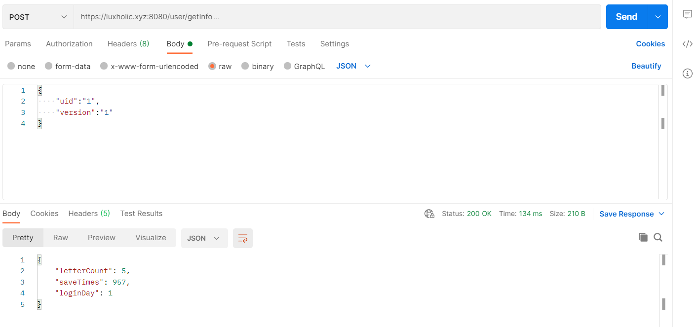

#### <font color=red>！！！！IMPORTANT</font>:

2. 前端需要维护一个**MissTimes**属性——代表已经连续多少次获取了和自己无关（既不是自己写的帖子，也没有自己写的评论）的帖子
2. 前端需要保存login时返回的uid作为以后交互的唯一标识（有那么一点点历史遗留问题的意味）
3. **！！除getTimer外都是POST方法（属于历史遗留问题）**

**随机算法：**

- 别介意怎么实现，我还没想好：times*Random() \> 5
- 暂时用的下述这个

```java
public class MyUtil {
    /**
     * 计算是否需要手动返回相关信件
     * @param missTimes
     * @return
     */
    public static boolean isNeedRelativeLetter(int missTimes){
        int base = (int)(3*Math.random())+1 ;

        //从每三封开始可能有，每六封必有一封是
        if ((base+missTimes)>=6){
            return true;
        }else {
            return false;
        }
    }
}
```

### 路由（接口）：

#### /timer/getTimer 

- 输入: 无
- 输出:  返回当前版本的version,leftTime, livingTime
- 对应功能：SF1


- 重启时返回ErrorCode=-1

#### /timer/getTimerByVersion

- 输入：Version

- 描述: 获取以前某个版本的livingTime

#### /Info/getConclusion

- 描述：返回生存时间， 用户量，发了多少帖子
- 原理：(nowTime - Timers.thisTimer.createdTime) : user isActive.count : letter.count
- 对应功能：SF1-F6.1

#### /user/login

- ```
  @RequestParam(name = "code") String code
  ```

- 传入wx.login API自带的code（404404是一个调试用code，无条件的对应404404openid）

- 参考资料：https://developers.weixin.qq.com/community/develop/article/doc/000c80906b4210625f3bde3775bc13

- **样例**

- 

- 如果没有创建过，会自动生成用户

- uid是之后交互的唯一标识

- openid无用

- active是该用户该版本内是否登陆过（）

- oldUser是该用户在上个版本是否登陆过（对应不那么新的新手教程）

- newDay指是不是当天第一次登陆

- 对应刺激序列1

前端代码样例





#### /user/getInfo

- 

- 接受参数，uid+version
- 描述：返回发了多少帖子，让这个小程序存在了多久，有多少天登陆过这个小程序
- 原理：letter(where uid=uid).count + userInf.savetimes + userInf.loginDay
- 对应：**SF1-F6.3**

#### /letter/writeLetter

```java
public class WriteLetterForm {
    private Integer uid;
    private String content;
}
```

- 接受：uid（用户唯一标识）,content（内容，需要字长限制）
- 描述：
  1. 将信件存入数据库
  2. **增添LID至对应的信件池**
- 返回：Boolean 表示一系列操作是否成功

#### /letter/writeResponse

```java
public class WriteResponseForm {
    private Integer uid;
    private Integer lid;
    private String content;
}
```

- 接受: lid(对应哪篇文章/在你收到的时候会发给你),uid, content
- 描述：
  1. 更新Response表
  2. **增添LID至对应的信件池**
- 返回：Boolean 表示一系列操作是否成功

#### /letter/getLetter
```java
public class GetLetterForm {
    private Integer uid;
    private Integer missTimes;
}
```
- 接受：用户标识UID + 多少次没有看到自己信息（missTimes）

```java
public class LetterVO {
    private Integer lid;
    private Integer uid;
    private String content;
    private Timestamp created;
}
```

返回：

描述：

1. 给一封信
2. 如果这封信与该用户相关，那么删除这封信（因为已经看过了，对用户来说就不是新鲜的了）

#### /letter/getResponse

- 接受

```java
public class GetResponseForm {
    //仅用作更新信件池
    private Integer uid;
    private Integer lid;
}
```

- 返回(一个JSON List)

```json
[
    {
        "uid": 1,
        "content": "我是第一条评论"
    },
    {
        "uid": 1,
        "content": "我是第二条评论"
    },
    {
        "uid": 1,
        "content": "我是第三条评论"
    },
    {
        "uid": 2,
        "content": "性测试"
    }
]
```

- 描述：
  - 返回Response
  - 根据是否相关，决定需要更新信件池
- PS：其实可以和之前那个一起返回但是感觉分开会更科学一点点(做完了发现一点都不科学因为Uid要传两次)


#### 数据库结构：

version 代表当前是第几次启动

Table (详见IBCDatabase.sql文件， 这边这个不是最新的)

- user(uid, username(拓展性需求)，type(拓展性需求), isActive)
- user_info    (**infoID**, uid, version,saveTimes, loginDay)
- user_letter (ulid,uid,lid)[ulid仅作为数据库范式要求]
- letters(lid,uid,content，createdTime)
- response(lid,uid,rid,content)
- Timers(id,version, livingTime)


额外维护一个TimerInstance


Bug

2. 需要checkActive方法
3. 并行设计要修复


user_info维护：

1. /register 时创建
2. 重启时更新letterCount 并创建新表
3. 写信，回帖时更新saveTimes


信件池：

维护相关帖子：

- 即用户发帖/跟帖后又没有被再次看到的帖子
  - 以为着在发帖/跟帖时增加
  - 在随机过程中看到/手动分配后删除

TODO：

1. 随机分发那个部分改过但没测试过