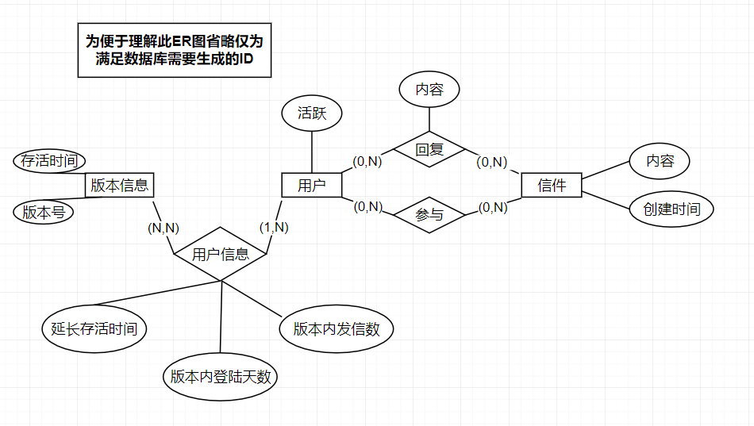

### 3.2 服务端

#### 3.2.1 开发框架

​	使用成熟的Spring Boot框架搭建服务 + Mybatis框架管理数据库，便于后续服务拓展

#### 3.2.2 部署环境

​	由于项目核心特性是会重置应用，为了避免过长的部署时间导致用户长时间等待，通过服务端直接执行由maven打包的jar包进行部署

#### 4.1.2 数据库设计

本应用的 E – R 图仅具有三个实体，分别是用户、信件、版本信息
具体E – R 图如下所示.

